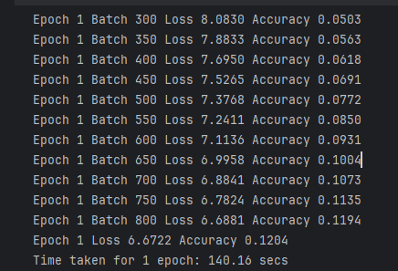
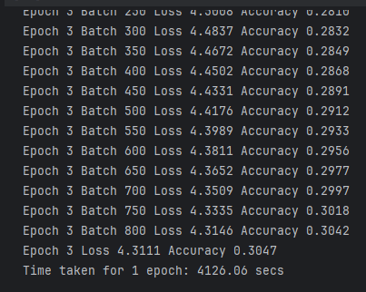

# Tradução Automática com Transformer - TensorFlow

Este repositório contém uma implementação de um modelo Transformer para tradução utilizando o TensorFlow com transformer. O modelo foi treinado para traduzir sentenças do português para o inglês, com base no dataset TED (`ted_hrlr_translate/pt_to_en`).

## Estrutura do Repositório

O repositório contém as seguintes seções principais:

1. **`train_gpu.ipynb`** - Implementação e treinamento do modelo Transformer utilizando GPU.
2. **`train_cpu.ipynb`** - Implementação e treinamento do modelo Transformer utilizando CPU.
3. **`README.md`** - Este arquivo, contendo informações sobre o projeto, comparações de desempenho e sugestões de melhorias.
4. **`img/`** - Diretório contendo prints dos tempos de treinamento para CPU e GPU.

## Treinamento do Modelo

O modelo foi treinado utilizando como base o tutorial do tensorflow com o dataset `ted_hrlr_translate/pt_to_en` disponível no TensorFlow Datasets.

### Comparativo: Treinamento com CPU vs. GPU

| **Métricas**        | **CPU**                                                                                            | **GPU**                                                                                                 |
|---------------------|----------------------------------------------------------------------------------------------------|---------------------------------------------------------------------------------------------------------|
| **Tempo de Treinamento** | ~4000 segundos (~1 hora e 7 minutos)                                                               | ~100 segundos (~2 minuto)                                                                               |
| **Uso de Memória**   | Consome mais memória devido ao processamento sequencial.                                           | Utiliza memória de forma otimizada, aproveitando o paralelismo da GPU.                                  |
| **Eficiência**       | O modelo demorou muito mais tempo para treinar, tornando-se inviável em casos de grandes datasets. | O treinamento foi significativamente mais rápido, possibilitando experimentos mais rápidos e eficientes. |
| **Requisitos de Hardware** | Requer apenas um processador (CPU) comum, o que pode ser uma limitação em termos de tempo.         | Requer uma GPU compatível, o que acelera drasticamente o tempo de treinamento.         |

### Print treinamento com gpu - 1 epoch

### Print treinamento com cpu - 1 epoch

---

## Pontos Positivos do conteúdo do tutorial

1. Didática Clara: O tutorial explica bem os conceitos do Transformer, desde o pré-processamento até a inferência.
2. Código Bem Estruturado: O código é modular, facilitando o entendimento de cada etapa do pipeline de tradução.
3. Uso de TensorFlow Datasets: O uso de ted_hrlr_translate/pt_to_en facilita o carregamento e o processamento dos dados.
4. Explicação sobre Attention Mechanism: O tutorial apresenta de forma detalhada a atenção multi-cabeça e como ela influencia na tradução.

---

## Pontos Negativos e Melhorias

- Requisitos Computacionais Elevados: Executar o modelo exige uma GPU potente, dificultando para quem tem hardware mais limitado.
- Pouca Exploração de Hiperparâmetros: O tutorial usa hiperparâmetros fixos sem explorar variações que poderiam melhorar a performance.
- Resultados Melhores Podem Exigir Mais Treinamento: Com apenas algumas épocas, a qualidade da tradução ainda pode ser baixa.
- Falta de Comparação com Modelos Mais Simples: Não há uma comparação direta com outros modelos de tradução, como LSTMs ou RNNs, para entender as vantagens do Transformer.
---
